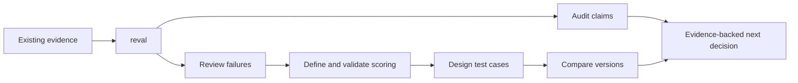

# Reval

**Agent skills for reviewing robot failures, building trustworthy evaluations, and comparing robot performance.**

For robot-learning and ROS application teams. Bring your existing logs, episodes,
evaluation code, or result tables. Reval gives your coding agent a focused workflow
for deciding what the evidence actually supports.

**Status:** 0.1.0 development preview. [Validation status](docs/results.md) ·
[How it works](docs/how-it-works.md) · [Contribute](CONTRIBUTING.md)

## Start with a question

> Can I trust these evaluation results?

Start with `reval`. It inspects your artifacts and routes to the workflow that
addresses the immediate uncertainty. No robot, GPU, simulator, or data migration
is required to audit existing results.



Use only the steps your question needs. Reval does not force every project through
the entire sequence.

## Install

Run from your project directory with Node.js installed:

```sh
npx skills@1.7.0 add https://github.com/isthatdebbiej/reval --agent codex --skill '*' --copy
# Or target Claude Code:
npx skills@1.7.0 add https://github.com/isthatdebbiej/reval --agent claude-code --skill '*' --copy
```

For a local checkout, replace the GitHub URL with its path. Quote paths containing spaces.
On PowerShell, use `npx.cmd` if script execution policy blocks `npx.ps1`.
These are project-scoped installs. Restart the agent session after installation.

Install just one specialist:

```sh
npx skills@1.7.0 add https://github.com/isthatdebbiej/reval --agent codex --skill reval-audit --copy
```

Source: [isthatdebbiej/reval](https://github.com/isthatdebbiej/reval).
See [compatibility and verified commands](docs/compatibility.md) for evidence and
manual installation. Agent skills themselves require no Node runtime.

## Try the bundled audit

Copy [the manipulation evidence](examples/manipulation/evidence.json) into a scratch
project containing the installed skills. Ask:

> Use reval-audit to audit evidence.json. Are the reported autonomous placement
> results justified? Cite episode IDs and explain uncertainty.

The fixture reports eight completions in ten attempts, including two operator
rescues. The recorded labels support six unassisted candidate completions; full physical
outcome verification is not present.
This is **synthetic teaching data**, not a measured robot result.

Follow the complete [manipulation walkthrough](examples/manipulation/README.md)
or [ROS navigation walkthrough](examples/navigation/README.md). Each separates
inputs, actual agent output, author review, and remaining independent validation.

## Skills

| Skill | Question it helps answer |
| --- | --- |
| [reval](skills/reval/SKILL.md) | Where should I start? |
| [reval-audit](skills/reval-audit/SKILL.md) | Can I trust this evaluation? |
| [reval-failures](skills/reval-failures/SKILL.md) | What failures does the evidence show? |
| [reval-score](skills/reval-score/SKILL.md) | Does the evaluator measure the intended outcome? |
| [reval-cases](skills/reval-cases/SKILL.md) | What should we test next? |
| [reval-compare](skills/reval-compare/SKILL.md) | Is the new version better under comparable conditions? |

Each specialist works independently. The router describes the next step if a
specialist has not been installed.

## What makes it robotics-specific?

- Task completion versus grasp, waypoint, action status, or reward.
- Assistance, retries, resets, aborts, and infrastructure failures.
- Clock alignment, coordinate frames, calibration, and temporal criteria.
- Correlated episodes and frames; leakage across objects, scenes, and tasks.
- Feasible perturbations and separate representative versus stress-test results.
- Clear boundaries between simulation, recorded hardware, and physical claims.

Outputs cite evidence and preserve unknowns. Reval does not certify safety,
operate hardware, or train policies merely because its skills are installed.

## Evidence, not promises

The repository includes [24 public development cases](evals/README.md), isolated
workspace preparation, a one-run CLI harness, and [reproducibility instructions](docs/validation.md).
Structural tests and agent effectiveness are different claims. See the
[current results](docs/results.md) before relying on compatibility or benefit claims.

## Help improve Reval

Submit an anonymized failure case, a reproduction, or a skill improvement with a
motivating example. We welcome manipulation and ROS navigation contributions equally.
Start with [CONTRIBUTING](CONTRIBUTING.md). No telemetry is collected by Reval.

## Origins and license

Inspired by [evals-skills](https://github.com/ai-evals-course/evals-skills),
[ASPIRE](https://research.nvidia.com/labs/gear/aspire/), and
[Robium](https://github.com/robium-ai/robium). Reval is independent and is not
endorsed by those projects. [Attribution](docs/attribution.md) explains what we use.

Original Reval contributions are [Apache-2.0 licensed](LICENSE).
Use [CITATION.cff](CITATION.cff) to cite the software; no paper or DOI is claimed.

